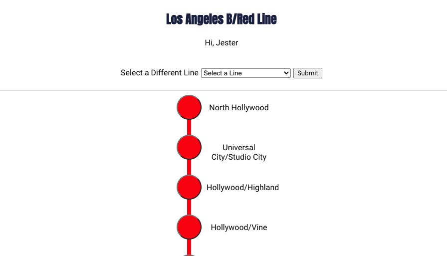

TRANSIT BUDDY
Summary: Transit Buddy is a tool for transit riders to see what obstacles they might encounter on their commute and report any obstacles they encounter.
These reports last for three days or until a certain number of unique users report them as resolved.

Live App: https://transitbuddy.netlify.app/
